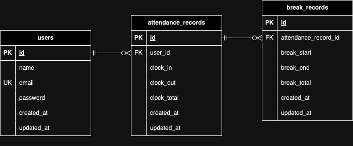

# Atte（勤怠管理システム）

## 環境構築

**Dockerビルド**
1. リポジトリをクローンする
```bash
`git clone git@github.com:minako-1221/attendance-system.git`
```
2. DockerDesktopアプリを立ち上げる
3. Dockerコンテナをビルド
```bash
`docker-compose up -d --build`
```

**Laravel環境構築**
1. PHPコンテナに入る
```bash
docker-compose exec php bash
```
2. Composerで必要なパッケージをインストール
```bash
composer install
```
3. `.env`ファイルを作成
```bash
cp .env.example .env
```
4. `.env`ファイルに以下の環境変数を追加
``` text
DB_CONNECTION=mysql
DB_HOST=mysql
DB_PORT=3306
DB_DATABASE=laravel_db
DB_USERNAME=laravel_user
DB_PASSWORD=laravel_pass
```
5. アプリケーションキーの作成
``` bash
php artisan key:generate
```
6. マイグレーションの実行
``` bash
php artisan migrate
```

## 使用技術（実行環境）

- PHP:8.3.13
- Laravel:8.83.27
- Composer:2.8.0
- MySQL:8.0.26
- Nginx:1.21.1

## ER図



## URL

- 開発環境：http://localhost/
- phpMyAdmin:http://localhost:8080/

## 使用方法

**会員登録**

1. 会員登録画面にアクセスする
```bash
http://localhost/register
```
2. 必要な情報（名前、メールアドレス、パスワード、確認用パスワード）を入力する
3. 会員登録ボタンを押す
4. 登録が完了するとホーム画面にリダイレクトされる

**ログイン**

1. ログイン画面にアクセスする
```bash
http://localhost/login
```
2. 登録したメールアドレスとパスワードを入力する
3. ログインボタンを押す
4. ログインに成功するとホーム画面にリダイレクトされる

**ホーム画面（打刻画面）**

### 勤務開始
1. 「勤務開始」ボタンをクリックする
2. 現在時刻がレコードに保存される
3. 「勤務終了」と「休憩開始」ボタンが使用可能になる

### 勤務終了
1. 「勤務終了」ボタンをクリックする
2. 現在時刻がレコードに保存される
3. 全てのボタンが使用不可能になる

### 休憩開始
1. 「休憩開始」ボタンをクリックする
2. 現在時刻がレコードに保存される
3. 「休憩終了」ボタンのみ使用可能になる

### 休憩終了
1. 「休憩終了」ボタンをクリックする
2. 現在時刻がレコードに保存される
3. 「休憩開始」と「勤務終了」ボタンが使用可能になる

**日付一覧**

1. ナビゲーションメニューの「日付一覧」をクリックする
2. 当日日付のユーザーごとの勤怠情報（勤務開始、勤務終了、休憩時間、勤務時間）が5名ずつ確認できる
3. 日付の左右にある矢印で日付を移動して別日の勤怠情報も確認できる
4. ページネーションを使用して全従業員の勤怠情報を表示できる

**ログアウト**

1. ナビゲーションメニューの「ログアウト」をクリックする
2. ログアウト後はログイン画面にリダイレクトされる

**注意事項**

- 勤務開始と勤務終了は1日に一度のみ
- 休憩開始と休憩終了は1日に複数回可能
- 日付が変わったら勤務が終了されていなくても翌日の打刻に切り替わる